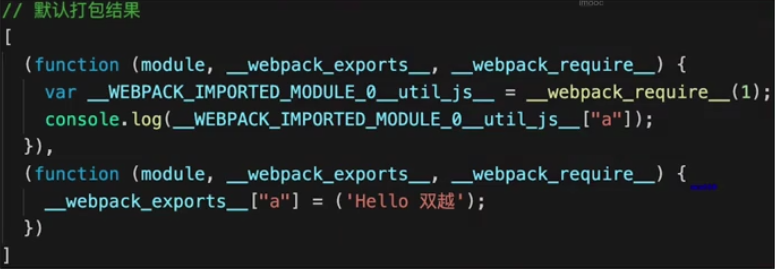
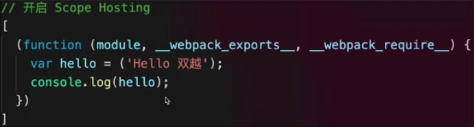

## 2020年学习Webpack笔记

### 1 初始化一个webpack项目

```
// 必须先全局安装
npm install -g webpack
npm install -g webpack-cli

// 项目下安装
npm init
npm install --save-dev webpack

// 打包
webpack
```

### 2 webpack打包

[视频 55:00 左右](https://www.bilibili.com/video/BV1a741197Hn?from=search&seid=9663403959295893105)

根据import引入等关键字，将依赖文件打包成一个文件。

#### 2.1 输出文件

输出文件的大体结构

```
(function(module) {
  var installedModules = {};
  function __webpack_require__(moduleId){
    // SOME CODE
  }
  // 。。。
  return __webpack_require__(0); // entry file
})([ /* modules array */])
```

上述结构中的核心方法：

```
function __webpack_require__(moduleId){
  // check if module is in cache
  if(installedModules[moduleId]){
    return installedModules[moduleId].exports;
  }
  // create a new module (and put into cache)
  var module = installedModules[moduleId] = {
    i: moduleId,
      l: false,
      exports: {}
  };
  // exe the module func
  modules[moduleId].call{
    module.exports,
      module,
      module.exports,
      __webpack_require__
  };
  // flag the module as loaded
  module.l = true;
  // return the exxports of the module
  return module.exports;
}
```

#### 2.2 webpack打包过程
1. 从入口文件开始，分析整个应用的依赖树
2. 将每个依赖模块包装起来，放到一个数组中等待调用
3. 实现模块加载的方法，并把它放到模块执行的环境中，确保模块间可以互相调用
4. 把执行入口文件的逻辑放在一个函数表达式中，并立即执行这个函数

### 3 实战

[视频 86:00 左右](https://www.bilibili.com/video/BV1a741197Hn?from=search&seid=9663403959295893105)

#### 3.1 语义化版本

1. ^version：中版本和小版本

    ^1.0.1 -> 1.x.x

2. ~version：小版本

    ^1.0.1 -> 1.0.x

3. version：特定版本

#### 3.2 初始化开发环境

1. webpack-dev-server
```
// 安装
npm install webpack-dev-server --save-dev

// 运行
webpack-dev-server
```

2. 遇到的问题：Error: Cannot find module 'webpack-cli/bin/config-yargs'
```
// 安装旧版本的 webpack-cli
npm install webpack-cli@3 --save-dev
```

#### 3.3 处理css

```
// 安装 样式 loader
npm install --save-dev css-loader style-loader
// 安装 样式预处理 loader
npm install --save-dev postcss-loader autoprefixer@7
// 处理 scss
npm install --save-dev sass-loader node-sass

// webpack-config.js 配置
devServer: {
  // 此路径下的打包文件可在浏览器中访问
  publicPath: '/dist'
},
module: {
  rules: [
    {
      test: /\.css$/,
      // 注意 loader 加载顺序和书写顺序是相反的
      use: [
        'style-loader',
        'css-loader',
        'postcss-loader'
      ]
    },
    {
      test: /\.(sass|scss)$/,
      // 注意 loader 加载顺序和书写顺序是相反的
      use: [
        'style-loader',
        'css-loader',
        'postcss-loader',
        'sass-loader'
      ]
    }
  ]
}

// 项目根目录新建 postcss.config.js
module.exports = {
  plugins: [
    require('autoprefixer')
  ]
}
```

1. 注意 loader 的顺序

2. devServer 不设置 publicPath 开发运行时会访问项目根目录

3. 抽离 css 单独文件

```
// 安装相关插件
npm install --save-dev mini-css-extract-plugin optimize-css-assets-webpack-plugin terser-webpack-plugin

// webpack.config.js
// 最好只在生产环境下配置

//将css打包成.css文件，而不是放在style标签内
const MiniCssExtractPlugin = require("mini-css-extract-plugin");
//压缩css代码
const OptimizeCssAssetsPlugin = require("optimize-css-assets-webpack-plugin");
//使用上面的插件后，js代码就不压缩了，要用这插件
const TerserWebpackPlugin = require("terser-webpack-plugin");

module: {
  rules: [
    {
      test: /\.css$/,
      // 注意 loader 加载顺序和书写顺序是相反的
      use: [
        {
          loader: MiniCssExtractPlugin.loader,
          options: {
            publicPath: '../../'
          }
        },
        'css-loader',
        'postcss-loader'
      ]
    },
    {
      test: /\.(sass|scss)$/,
      // 注意 loader 加载顺序和书写顺序是相反的
      use: [
        {
          loader: MiniCssExtractPlugin.loader,
          options: {
            publicPath: '../../'
          }
        },
        'css-loader',
        'postcss-loader',
        'sass-loader'
      ]
    },
  ]
},
optimization: {
  minimizer: [new OptimizeCssAssetsPlugin(), new TerserWebpackPlugin()]
},
plugins: [
  // 抽离css
  new MiniCssExtractPlugin({
    filename: 'static/css/main.[hash].css'
  })
]

```

#### 3.4 处理图片

```
// 安装 loader
npm install --save-dev file-loader url-loader

// webpack-config.js 配置
module: {
  rules: [
    //处理文件
    {
      test: /\.(png|jpg|gif)$/i,
      use: [
        {
          loader: "url-loader",
          options: {
            outputPath: "static/img/",
            limit: 200 * 1024 //小于200kb用base64解析
          }
        }
      ]
    }
  ]
}
```

#### 3.5 处理html

```
// 安装 plugin
npm install --save-dev html-webpack-plugin copy-webpack-plugin@5 html-withimg-loader

// 将静态文件都放到public文件夹下

// webpack-config.js 配置
// 打包路径
output: {
  filename: 'static/js/main.js'
},
devServer: {
  contentBase: path.join(__dirname, "public")
},
module: {
  rules: [
    //处理在html中图片文件路径
    {
      test: /\.html$/,
      use: "html-withimg-loader"
    }
  ]
},
plugins: {
  new HtmlWebpackPlugin({
    template: "./public/index.html",
    filename: "index.html"
  }),
  new CopyWebpackPlugin([
    // 把 static 文件内的内容复制到 output.path 路径下的static文件内
    {
      from: path.join(__dirname, 'public/static'),
      to: "./static"
    }
  ])
}
```

1. 如果 html-withimg-loader 无效，可以试着将 file-loader 或者 url-loader 的 options.esModule 设为false
2. 如果要在 HtmlWebpackPlugin 设置 title 需要在 html 添加 <title><%= htmlWebpackPlugin.options.title %></title> 替换，并且会和 html-withimg-loader 冲突无效

#### 3.6 环境变量

```
npm install --save-dev webpack-merge

// 项目根目录新建 webpack.dev.js 和 webpack.prod.js
// 开发环境：development、生成环境：production
const webpack = require('webpack')
const { merge } = require('webpack-merge')
const base = require('./webpack.config.js')

module.exports = merge(base, {
  mode: 'development',
  plugins: [
    new webpack.DefinePlugin({
      NODE_ENV: "'development'",
      BASE_API: "'/dev'"
    })
  ]
})

// package.json
{
  "scripts": {
    "dev": "webpack-dev-server --config webpack.dev.js",
    "dev:prod": "webpack-dev-server --config webpack.prod.js",
    "build": "webpack --config webpack.prod.js"
  }
}
```

#### 3.7 babel 处理新语法

安装 babel-loader 处理 es6 等新语法

```
// 安装
npm install --save-dev  babel-loader@8.0.0-beta.0 @babel/core @babel/preset-env

// webpack.config.js
module: {
  rules: [
    {
      test: /\.(js|jsx)$/,
      use: 'babel-loader',
      exclude: path.resolve('node_modules'),
      include: path.resolve('src')
    },
  ]
}

// 根目录下新建 .babelrc
{
  "presets": [
    "@babel/preset-env"
  ],
  "plugins": []
}
```

#### 3.8 设置别名

```
// 方便模块的应用
resolve: {
  alias: {
    '@': path.resolve(SrcPath)
  }
},
```

#### 3.9 多入口文件

```
// webpack.config.js

//  入口文件
entry: {
  index: path.resolve(SrcPath, 'index.js'),
  readme: path.resolve(SrcPath, 'readme.js'),
},
// 打包路径
output: {
  // [name]：多入口文件名
  // [hash]：hash值
  filename: 'static/js/[name].[hash].js'
},

plugins: [
  new HtmlWebpackPlugin({
    template: path.resolve(__dirname, StaticPath, 'index.html'),
    filename: 'index.html',
    // 只引用某些入口文件，这些入口的值要在 entry 设置
    chunks: ['index']
  }),
  new HtmlWebpackPlugin({
    template: path.resolve(__dirname, StaticPath, 'index.html'),
    filename: 'readme.html',
    // 只引用某些入口文件，这些入口的值要在 entry 设置
    chunks: ['readme']
  }),
]
```

1. 注意 HtmlWebpackPlugin 的 chunks 数组要设置 entry 有的值


#### 3.10 抽离第三方模块和公共代码

```
// webpack.prod.js 最好只配置生产环境
optimization: {
  // 代码分割
  splitChunks: {
    /**
      * initial：对异步导入的文件不处理
      * async：只对异步导入的文件进行处理
      * all：全部
    */
    chunks: 'all',
    cacheGroups: {
      // 第三方模块
      vendor: {
        // chunks 名称
        name: 'vendor',
        // 权重，越高越优先抽离
        priority: 1,
        test: /node_modules/,
        // 大小限制：大于多少才抽离
        minSize: 0,
        // 复用限制：用了多少次才抽离
        minChunks: 1
      },
      // 公共模块
      common: {
        name: 'common',
        priority: 1,
        minSize: 0,
        minChunks: 2
      },
    }
  }
}
```

1. chunks 名称可以用于 HtmlWebpackPlugin 的 chunks 配置哪个入口文件用哪部分的代码，但是一般会智能地帮你设置好。

#### 3.11 处理 vue 和 jsx

```
// 处理 .vue 文件
npm install --save-dev vue-loader vue-template-compiler

// vue 中使用 jsx
npm install --save-dev babel-plugin-transform-vue-jsx

// webpack.config.js
// 处理 vue
const VueLoaderPlugin = require('vue-loader/lib/plugin')

plugins: [
  new VueLoaderPlugin()
]
```

#### 3.12 module chunk 和 bundle 的区别

1. module - 各个源码文件、图片、样式，在 webpack 中都是模块
2. chunk - 代码块，entry 入口文件设置、import 异步加载、splitChunks 分割代码块
3. bundle - 最终输出的文件

### 4 webpack 性能优化

#### 4.1 优化 babel-loader

```
module: {
  rules: [
    {
      test: /\.(js|jsx)$/,
      // cacheDirectory：开启缓存
      use: 'babel-loader?cacheDirectory',
      // 明确范围
      exclude: path.resolve('node_modules'),
      include: path.resolve('src')
    }
  ]
}
```

#### 4.2 多进程打包

1. JS 是单线程的，可以开启多进程打包（区分好线程和进程）
2. 项目较大，打包慢，启动多进程能提高打包速度
3. 项目较小，打包块，启动多进程反而会影响打包速度，因为开启进程也是需要时间的
4. 按需使用

```
// 安装
npm install --save-dev happyPack webpack-parallel-uglify-plugin
// webpack.prod.js
// 开启多进程打包
const Happypack = require('happypack')
//  开启多进程压缩 js 代码
const WebpackParallelUglifyPlugin = require('webpack-parallel-uglify-plugin')


module: {
  rules: [
    // 处理 js 新语法
    {
      test: /\.(js|jsx)$/,
      // 使用 Happypack 开启多进程打包
      use: 'Happypack/loader?id=babel',
    },
  ]
},
plugins: [
  // 开启多进程打包
  new Happypack({
    id: 'babel',
    use: [
      {
        // cacheDirectory：开启缓存
        loader: 'babel-loader?cacheDirectory'
      }
    ]
  }),
  // 开启多进程压缩 js 代码
  new WebpackParallelUglifyPlugin({
    test: /.js$/g,
    include: [],
    exclude: [],
    cacheDir: '',
    workerCount: '',
    sourceMap: false,
    uglifyJS: {
      output: {
        /*
          是否输出可读性较强的代码，即会保留空格和制表符，默认为输出，为了达到更好的压缩效果，
          可以设置为false
        */
        beautify: false,
        /*
          是否保留代码中的注释，默认为保留，为了达到更好的压缩效果，可以设置为false
        */
        comments: false
      },
      /*
        是否在UglifyJS删除没有用到的代码时输出警告信息，默认为输出，可以设置为false关闭这些作用
        不大的警告
      */
      warnings: false,
      compress: {
        /*
          是否删除代码中所有的console语句，默认为不删除，开启后，会删除所有的console语句
        */
        drop_console: true,
        /*
          是否内嵌虽然已经定义了，但是只用到一次的变量，比如将 var x = 1; y = x, 转换成 y = 5, 默认为不
          转换，为了达到更好的压缩效果，可以设置为false
        */
        collapse_vars: true,
        /*
          是否提取出现了多次但是没有定义成变量去引用的静态值，比如将 x = 'xxx'; y = 'xxx'  转换成
          var a = 'xxxx'; x = a; y = a; 默认为不转换，为了达到更好的压缩效果，可以设置为false
        */
        reduce_vars: true
      }
    }
  }),
]
```

#### 4.3 热更新

```
// 热更新
const HotModuleReplacementPlugin = require('webpack/lib/HotModuleReplacementPlugin')

// webpack.dev.js
//  入口文件
entry: {
  index: [
    // http://localhost:3000/
    'webpack-dev-server/client?http://'+ Host + ':' + Port,
    'webpack/hot/dev-server',
    path.resolve(SrcPath, 'index.js')
  ],
},
devServer: {
  hot: true
},
plugins: [
  // 热更新
  new HotModuleReplacementPlugin()
]
```

#### 4.4 DllPlugin 动态链接库插件

1. 前端框架如 Vue、React，体积较大，构建慢
2. 版本稳定，不常更新
3. 同一个版本构建一次即可，不用每次都重复构建

```
// config.js
// 动态链接库生产目录
const DllPath = StaticPath + '/static/dll'

// webpack.dll.js
const path = require('path')
const { DllPath } = require('./config')
const Mode = 'development'

const DllPlugin = require('webpack/lib/DllPlugin')

module.exports = {
  mode: Mode,
  // 入口文件
  entry: {
    // 把相关模块放进一个单独的动态链接库
    vue: ['vue']
  },
  output: {
    // 输出的动态链接库文件名称，也就是 entry 中设置的属性名
    filename: '[name].dll.js',
    // 输出的文件目录
    path: path.join(__dirname, DllPath),
    // 存放动态链接库的全局变量名称，加上_dll_ 是为了防止全局变量冲突
    library: '_dll_[name]'
  },
  plugins: [
    new DllPlugin({
      // 动态链接库的全局变量名称，和 output.library 保持一致
      name: '_dll_[name]',
      // 描述动态链接库的描述文件
      path: path.resolve(DllPath, '[name].manifest.json')
    })
  ]
}

// package.json
"scripts": {
  "dll": "webpack --config webpack.dll.js"
}

// 运行命令生产动态链接库
npm run dll

// webpack.config.js
const { DllPath } = require('./config')
// 动态链接库
const DllReferencePlugin = require('webpack/lib/DllReferencePlugin')

plugins: {
  // 使用 vue 的动态链接库
  new DllReferencePlugin({
    manifest: require(path.join(__dirname, DllPath, 'vue.manifest.json'))
  })
}
```

#### 4.5 Tree-Shaking

1. 生产环境没使用的代码不会打包
2. 开发环境没使用的代码也会构建

#### 4.6 ES6 Module 和 Commonjs 的区别

1. ES6 Module 静态引用，编译时引用
2. Commonjs 动态引用，执行时引用
3. 只有 ES6 Module 才能静态分析，实现 Tree-Shaking

```
// ES6 Module 静态引入
import api from 'api.js'

if (isOk) {
  // 编译时报错，只能静态引入
  import util from 'util.js'
}


// Commonjs 动态引入
const api = require('api.js)
if (isOk) {
  // 编译不报错，可以动态引入
  const util = require('util.js')
}
```

#### 4.7 Scope Hosting

1. 源代码

[$DL.png)

2. 默认打包结果



3. 开启 Scope Hosting

```
// webpack.prod.js
// 开启 Scope Hosting
const ModuleConcatenationPlugin = require('webpack/lib/optimize/ModuleConcatenationPlugin')

resolve: {
  // 针对 Npm 中的第三方模块优先采用 jsnext:main 中指向 ES6 模块化语法的文件
  mainFields: ['jsnext:main', 'browser', 'main']
},
plugins: [
  // 开启 Scope Hosting
  new ModuleConcatenationPlugin()
]
```



#### 4.8 babel 详解

1. presets - 集成了多个 plugin
2. @babel/preset-env - 集成了ES6、ES7等语法
3. babel-polyfill - 一些低版本的浏览器不兼容新的函数，需要手动实现
4. core-js - 标准的 babel-polyfill
5. regenerator - 补充 core-js
6. 7.4.0 及以上 @babel/preset-env 直接包含 core-js 和 regenerator，babel-polyfill 已经被弃用了，[详情](https://blog.csdn.net/qq_29722281/article/details/101444335)
7. 按需引入

```
// 安装
npm install core-js regenerator-runtime

// .babelrc

/**
* useBuiltIns：引入方式
* false: 相当于没用，这时就得手动引入所有的 polyfill
* entry: 也需要手动引入 polyfill，即 import ‘@babel/polyfill’;，同时也引入了所有的 polyfill。这个配置项，总觉得没什么用，如果有老哥知道的话可以在评论区提出一起讨论。
* usage: 无需引入 polyfill，babel 会自动按需加载需要的功能
*/

{
  "presets": [
    [
      "@babel/preset-env",
      {
        "useBuiltIns": "usage",
        "corejs": 3
      }
    ]
  ]
}

```

8. babel-polyfill 有一个问题就是会污染全局变量，这在写第三方库的时候很不友好，需要用到 babel-runtime 来解决

```
// 安装
npm install --save-dev @babel/plugin-transform-runtime

/**
* corejs
* false: npm install --save @babel/runtime
* 2: npm install --save @babel/runtime-corejs2
* 3: npm install --save @babel/runtime-corejs3
*/

// 注意环境
// 这里安装的是 corejs 3 ，要根据 .babelrc 的设置来安装
npm install --save @babel/runtime-corejs3

// .babelrc
{
  "plugins": [
    "transform-vue-jsx",
    [
      "@babel/plugin-transform-runtime",
      {
        "corejs": 3
      }
    ]
  ]
}
```


